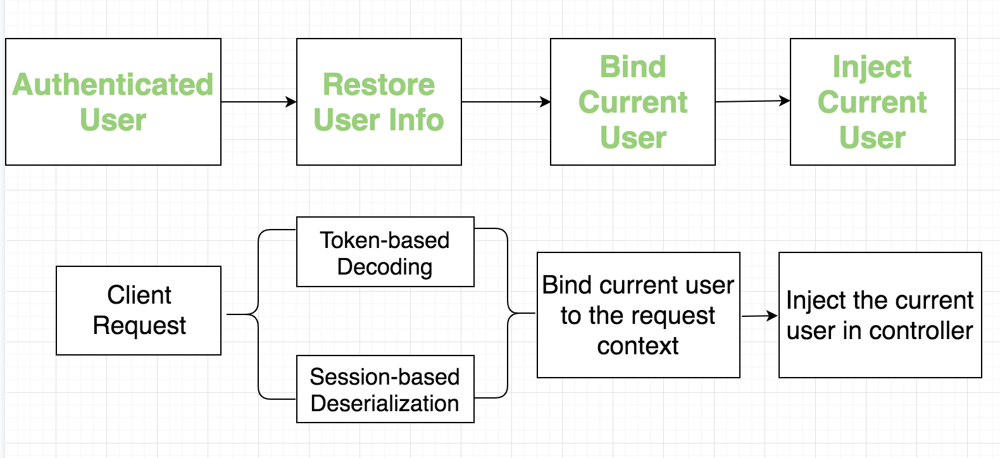
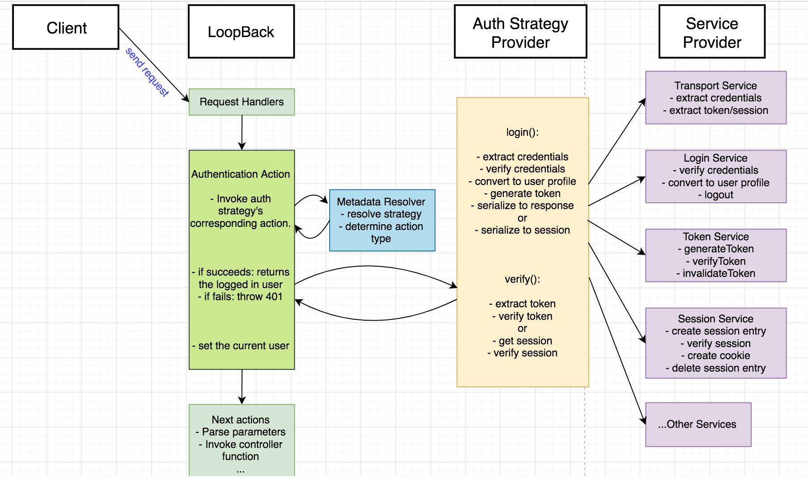

## Multiple Authentication strategies

An authentication system in a LoopBack 4 application could potentially support multiple popular strategies, including basic auth, oauth2, saml, openid-connect, etc...And also allow programmers to either token based or session based approach to track the logged in user.

The diagram below illustrates the high level abstraction of such an extensible authentication system.

Assume the app has a static login page with a list of available choices for users to login:

- local: basic auth with email/username + password, user is stored in a database
- facebook account: oauth2
- google account: oauth2
- ibm intranet account: saml
- openid account: openid-connect
- ...

By clicking anyone of the links, you login with a particular account and your status will be tracked in session(session-based auth) or your profile will be encoded into the JWT token(token-based auth).

A common login flow for all strategies would be: the authentication action verifies the credentials and returns the raw information of that logged in user.

Here the raw information refers to the data returned from a third-party service or a persistent database. Therefore You need another step to convert it to a user profile instance which describes your application's user model identically. Finally the user profile is either tracked by a generated token or session + cookie.

The next diagram illustrates the flow of verifying the client requests sent after the user logged in.

The request goes through the authentication action which decodes/deserializes the user profile from token/session, binds it to the request context so that actions after authenticate could inject it using DI.

Next let's walk through the typical API flow of user login and user verification.

## API Flows (using JWT as example)

Other than the LoopBack core and its authentication module, there are different services included and integrated together to perform the authentication.

The next diagram, using the JWT authentication strategy as an example, draws two API flows: 

- Login: user login with email+password
- Verify: verify the logged in user

along with the responsibilities divided among different services:

- LoopBack core: resolve a strategy based on the endpoint's corresponding authentication metadata, invoke the authentication action provided as strategy function.

- Authentication strategy provider: 
  - (login flow) verify user credentials and return a token that tracks user.
  - (verify flow) verify the token and decode user profile from it.

- Authentication services: some utility services that can be injected in the strategy class. (Each service's functionalities will be covered in the next section)

## Authentication framework architecture

The following diagram describes the architecture of the entire authentication framework and the detailed responsibility of each part.

You can check the pseudo code in folder `docs` for:

- [authentication-action](./docs/authentication-action.md)
- [authentication-strategy](./docs/authentication-action.md)
- [endpoints defined in controller](./docs/controller-functions.md)
- [jwt strategy](./doc/strategies/jwt.md)
- [oauth2 strategy](./doc/strategies/oauth2.md)

And the abstractions for:

- [login service](./src/services/login.service.ts)
- [transport/client service](./src/services/client.service.ts)

### Token based authentication

- Login flow
  - authentication action:
    - resolve metadata to get the strategy
    - invoke strategy.login()
  - strategy:
    - extract credentials from 
      - transport layer (call credential transport service)
      - or local configuration file (call credential transport service)
    - verify credentials (call login service) and get the user profile
    - generate token (call token service)
    - return token
  - controller function:
    - TBD: How to serialize the token into response? Do we want to do it in controller?

- Verify flow
  - authentication action:
    - resolve metadata to get the strategy
    - invoke strategy.verify()
    - set the current user as the return of strategy.verify()
  - strategy:
    - extract access token from transport layer(call token transport service)
    - verify access token(call token service)
    - decode user from access token(call token service)
    - return user
  - controller:
    - process the injected user

### Session based authentication

- Login flow
  - authentication action:
    - resolve metadata to get the strategy
    - invoke strategy.login()
  - strategy:
    - extract credentials from 
      - transport layer (call credential transport service)
      - or local configuration file (call credential transport service)
    - verify credentials (call login service) and get the user profile
    - serialize user info into session(call session service)

- Verify flow
  - authentication action:
    - resolve metadata to get the strategy
    - invoke strategy.verify()
    - set the current user as the return of strategy.verify()
  - strategy:
    - extract session info from cookie(call session service)
    - serialize user info from session(call session service)
    - return user
  - controller function:
    - process the injected user
